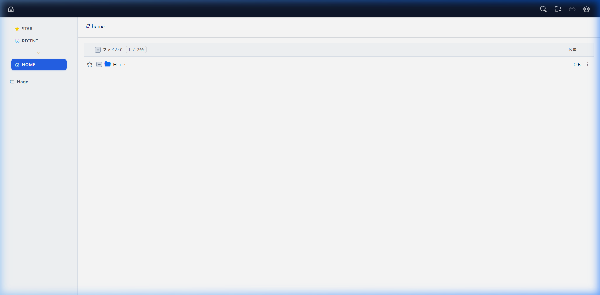
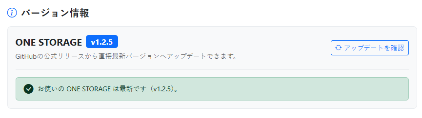

# ONE STORAGE (EN/JP)

**Ultra-lightweight, encrypted personal storage tailored for solo users on budget shared hosting, VPS, and Docker.**
**月額100円台の格安共用サーバーからVPS・Dockerまで、個人利用に特化した超軽量・暗号化パーソナルストレージ**

**[EN]**
No need to be bound by changing terms of service or AI training scans of big tech clouds.
**ONE STORAGE** is an ultra-lightweight, PHP-native personal cloud storage engineered specifically for solo user use. By simply placing a single file on a budget shared hosting server, an idle VPS, a Raspberry Pi, or a Docker environment, you gain an ultra-fast, encrypted personal vault that keeps your most sensitive information completely private.

**[JP]**
大手クラウドの規約変更やAI学習スキャンに縛られる必要はありません。
**ONE STORAGE**は、月額100円台の格安共用サーバーから余剰VPS・Raspberry Pi、Docker環境にファイルを1つ置くだけで完結する、**個人利用を目的としたPHPネイティブの超軽量なパーソナルストレージ**です。単独ユーザーの利用に特化して極限まで贅肉を削ぎ落とし、誰にも見られたくないプライベートな情報を安価・軽量・安全に保護します。



## Key Features

### AES-256-CBC Stream Encryption & Data Isolation
**[EN]**
Uploaded files are encrypted on disk via AES-256-CBC with zero plaintext left on the server, blocking hosting staff and AI crawlers. Memory-efficient streaming runs smoothly on low-spec servers (128MB RAM), and files can always be decrypted offline with standalone recovery tools.

**[JP]**
保存ファイルはAES-256-CBCで常時暗号化され、サーバー上に平文を残さず第三者やAIの検閲を無力化します。ストリーム処理により低スペック環境（128MB RAM）でも軽快に動作し、万一の際も同梱ツールで手元PCから安全にオフライン一括復号できます。

### Workflow-Centric Standard Directories
**[EN]**
Designed around a solo user's real daily workflow with dedicated standard directories:
- **INBOX**: A quick landing drop zone for unsorted files before organizing.
- **RECENT**: View up to 100 recently modified files with task-like temporary dismiss capabilities.
- **STAR**: One-click bookmarking for essential, frequently accessed files and folders.
- **SHARE**: An isolated public directory physically separated from your private vault for secure link sharing.

**[JP]**
個人利用のリアルな作業フローに最適化された4つの標準ディレクトリを搭載しています。
- **INBOX**: 保存先フォルダを後から決めたいファイルや未整理データを一時的に放り込める専用トレイ。
- **RECENT**: 更新順に最大100件を表示し、リストから一時除外できるタスクライクな管理ビュー。
- **STAR**: よく使うファイルやフォルダをワンクリックでピン留め。
- **SHARE**: 個人保管庫とは完全に切り離された、安全なファイル共有専用ディレクトリ。

### Thoughtful Minimalism & Safety Constraints
**[EN]**
ONE STORAGE purposefully eliminates unnecessary features to maintain high security, lightweight performance, and clutter-free storage:
- **No File Duplication (No Copy)**: Prevents data bloat and confusion over which copy is the source of truth.
- **Protected Folder Deletion**: To prevent server timeouts and catastrophic accidental data loss, folders can only be deleted when completely empty.
- **Physical Sharing Isolation**: Unlike ordinary cloud storage where private files are shared directly via URLs, files must be explicitly moved or uploaded to the dedicated SHARE box, preventing accidental exposure or forgotten public links.
- **PDF Preview**: Encrypted PDFs can be scrolled directly in the browser. Temporary preview cache files are automatically deleted from the server the moment the tab is closed.
- **On-Demand Fullscreen Image Viewer**: Encrypted photos (JPG, PNG, GIF, WebP, SVG, etc.) can be viewed in an immersive fullscreen dark viewer with keyboard navigation (←/→/Esc). Features on-demand stream decryption, spam-click debouncing, single-item preloading, and immediate memory release upon closing to protect server resources.

**[JP]**
ストレージの圧迫や誤操作を防ぎ、高いセキュリティと軽快さを維持するための意図的な設計方針を採用しています。
- **コピー機能の非搭載**: ファイル複製によるストレージ圧迫と「どれが最新版か」の混乱を防ぐため、コピー機能は意図的に非搭載。
- **フォルダ削除の保護制限**: 再帰削除によるサーバー負荷や誤操作による一括消失を防ぐため、「中身が空の場合のみ削除可能」という安全機構を採用。
- **共有の物理分離**: プライベートファイルを直接URL公開するのではなく、隔離されたSHARE領域へ明示的に移動・配置して公開することで、誤公開やリンク解除忘れを根本から防止。
- **PDFプレビュー**: 暗号化されたPDF文書をブラウザ上で縦スクロール閲覧可能。生成された一時キャッシュはタブを閉じた瞬間にサーバーから自動削除されます。
- **オンデマンド全画面画像ビューアー**: 暗号化された画像（JPG, PNG, GIF, WebP, SVG等）を没入感のある全画面黒背景ビューアーで軽快に閲覧可能。キーボード操作（←/→/Esc）に対応し、オンデマンド復号ストリーム、連打抑止デバウンス、前後1枚限定プリロード、閉じる際のメモリ即時解放により、サーバーおよび端末リソースを徹底保護。

### Chunked Upload
**[EN]**
Asynchronous chunked file uploading bypasses restrictive server upload limits, memory constraints (`memory_limit`), and execution timeouts (`max_execution_time`), enabling stable and reliable transfers for large files even on budget hosting.

**[JP]**
ファイルを小ブロックに分割して非同期転送するチャンク分割アップロードにより、サーバーのアップロード容量制限、メモリ制限（`memory_limit`）、タイムアウト制限（`max_execution_time`）を回避し、低スペックなサーバーでも大容量ファイルを安定してアップロードできます。

### Multi-Factor Authentication (MFA) & Enterprise-Grade Security
**[EN]**
- **Mandatory TOTP MFA**: Enforces 6-digit one-time password authentication via Google Authenticator or compatible TOTP apps.
- **Strict Credential Policy**: Mandates passwords of 15+ characters with uppercase, lowercase, and numbers.
- **HMAC-SHA256 Signed Cookies**: Sessions are cryptographically signed. Password updates immediately invalidate all existing sessions and cookies.
- **Defense in Depth**: Real data stored under obfuscated random directories, guarded by multi-layer `.htaccess` rules and direct-execution prevention (`ONESTORAGE_RUNNING`).
- **Self-Security Diagnostic**: Verify directory access permissions and `.htaccess` protection with one click in the admin console.

**[JP]**
- **二要素認証（MFA/TOTP）必須**: Google Authenticator等による6桁ワンタイムパスワード認証を標準化。
- **15文字以上の厳格なパスワードポリシー**: 大文字・小文字・数字の混在を必須化。
- **HMAC-SHA256署名付きセキュアクッキー**: セッション改ざんを防止。パスワード変更時には秘密鍵が自動再生成され、既存の全セッションを一括強制ログアウト。
- **多層防御**: 推測不能なランダムディレクトリ名、多層の`.htaccess`による直接アクセス拒否、スクリプト直接実行防止（`ONESTORAGE_RUNNING`）。
- **セルフセキュリティ診断**: 設定ファイルやデータ領域の保護状態を管理画面からワンクリックで自動検査。

## System Requirements & Environment

**[EN]**
- **Intended Users:** 1 user (personal use)
- **Supported Environments:** Linux (Ubuntu recommended), Shared Web Hosting, Docker container, Raspberry Pi
- **Web Server:** Apache / Nginx
- **PHP Version:** PHP 8.0+ (8.2 - 8.5 recommended)
- **Required PHP Extensions:** `pdo_sqlite`, `zip` (ZipArchive), `curl` (or `allow_url_fopen = On`)
- **Database:** SQLite (No external DB required)
- **Recommended RAM:** 128MB or more
- **Shared Hosting WAF Tip:** Web Application Firewalls (WAF) on some shared hosting services may misinterpret chunked API transfers. If transfer errors occur, temporarily disable WAF for the specific installation directory in your server control panel.
- **VPS / Home Server Tip:** On minimal OS installations, ensure required PHP extensions are installed: `pdo_sqlite`, `zip` (ZipArchive), and `curl` (or `allow_url_fopen = On`).
- **Persistent Storage Notice:** Stateless serverless environments (AWS Lambda, Cloud Run without volume mounts) are not supported. For Docker, ensure persistent volumes are mounted to the app directory.

**[JP]**
- **想定ユーザー数:** 1名（単独パーソナル利用）
- **対応OS / 環境:** Linux（Ubuntu推奨）、共用レンタルサーバー、Dockerコンテナ、Raspberry Pi
- **Webサーバー:** Apache / Nginx
- **PHPバージョン:** 8.0 以上（8.2 - 8.5 推奨）
- **必須PHP拡張:** `pdo_sqlite`, `zip` (ZipArchive), `curl`（または `allow_url_fopen = On`）
- **データベース:** SQLite（MySQL等の外部DB不要）
- **推奨RAM:** 128MB 以上
- **共用サーバーのWAFに関する注意点:** 一部の共用レンタルサーバーのWAFが、API通信やチャンク転送を機械的に誤検知して遮断する場合があります。エラーが発生する場合は、サーバー管理パネルから該当ディレクトリのWAFを一時的に無効（OFF）に設定してください。
- **VPS / 自宅サーバーを利用する場合:** OSインストール直後の最小環境では、必須PHP拡張`pdo_sqlite` / `zip` (ZipArchive) / `curl`（または `allow_url_fopen = On`）をインストールしてください。
- **永続化に関する注意点:** コンテナ再起動等でローカルデータが消失するステートレス環境（Lambda、ボリュームマウントなしのCloud Run等）では利用できません。Docker運用の際は公開ディレクトリを必ずホスト側にボリュームマウントしてください。

### Docker Sample

```Dockerfile
FROM php:8.5-apache

RUN apt-get update && apt-get install -y \
    libzip-dev \
    libsqlite3-dev \
    curl \
    && docker-php-ext-install pdo_sqlite zip \
    && a2enmod rewrite \
    && rm -rf /var/lib/apt/lists/
```
```yaml
services:
  onestorage:
    build: .
    container_name: onestorage
    ports:
      - "8080:80"
    volumes:
      - ./app:/var/www/html
    restart: unless-stopped
```

## Installation

<div style="position: relative; width: 100%; aspect-ratio: 16 / 9; overflow: hidden; border-radius: 1rem; margin: 1rem 0;">
  <iframe
    src="https://www.youtube.com/embed/QBYMbYhHbQ8"
    title="ONE STORAGE Installation Guide"
    style="position: absolute; inset: 0; width: 100%; height: 100%; border: 0;"
    allow="accelerometer; autoplay; clipboard-write; encrypted-media; gyroscope; picture-in-picture; web-share"
    referrerpolicy="strict-origin-when-cross-origin"
    allowfullscreen
  ></iframe>
</div>

**[EN]**
Setting up ONE STORAGE takes only a few minutes with the single-file automated installer.

1. Download `installer.php` from the [Releases](https://github.com/kmzk-dev/public-onestorage/releases) page.
2. Upload `installer.php` to your web server's public document root (e.g., `public_html/` or `/var/www/html/`).
3. Open `https://your-domain.com/installer.php` in your browser. The installer automatically verifies system requirements, downloads the latest release, and extracts all files.
4. Follow the setup wizard to configure:
   - Administrator email (used as key derivation seed; fictional/dummy address is allowed)
   - Password (15+ characters, uppercase, lowercase, numbers)
   - Two-Factor Authentication (TOTP optional; via Google Authenticator or compatible apps)

**[JP]**
ONE STORAGEの導入は、`installer.php` 1ファイルを配置するだけでわずか数分で完了します。

1. [Releases](https://github.com/kmzk-dev/public-onestorage/releases) ページから最新の `installer.php` をダウンロードします。
2. サーバーの公開ディレクトリ（`public_html` や `/var/www/html/` 等）に `installer.php` をアップロードします。
3. ブラウザで `https://あなたのドメイン/installer.php` にアクセスします。環境チェック、最新パッケージのダウンロード、自動展開が実行されます。
4. 画面の指示に従い、以下を登録してセットアップを完了します。
   - 管理者メールアドレス（暗号鍵派生のシードとして使用。実在しない架空のアドレスでも可）
   - パスワード（大文字・小文字・数字を含む15文字以上）
   - 二要素認証（MFA: 任意設定。Google Authenticator等でQRコードをスキャン）

## Updating

**[EN]**
Existing configurations (`config/`), encrypted files (`data*` / `share*`), and SQLite database (`.storage.db`) are **100% preserved** during updates.

### One-Click Admin Update
1. Log in to the admin panel (`https://your-domain.com/admin.php`).
2. In the **Version Info** section, click **"Check for Updates"**.
3. If a new version is found, select the target version and click **"Update to this version"**.
4. The system automatically downloads, extracts, and securely overwrites the application files.

**[JP]**
既存の設定（`config/`）、暗号化データ領域（`data*` / `share*`）、データベース（`.storage.db`）を**100%保持したまま**安全に最新版へ更新できます。

### 管理画面からのワンクリックアップデート
1. 管理画面（`https://あなたのドメイン/admin.php`）にログインします。
2. **「バージョン情報」** セクションの **「アップデートを確認」** ボタンをクリックします。
3. 新しいバージョンが検出された場合、更新先バージョンを選択し **「このバージョンにアップデート」** をクリックします。
4. 自動的に最新パッケージのダウンロード・展開・安全なファイル上書きが行われます。



## Target Audience & Use Cases

**[EN]**
| Target Audience | Key Use Cases & Benefits |
| :--- | :--- |
| **Personal Creators & Freelancers** | Store sensitive manuscripts, design assets, and raw footage safely without fear of automated cloud AI scraping or platform lock-in. |
| **Shared Hosting Owners** | Convert hundreds of unused gigabytes in cheap web hosting plans (from $1/mo) into a lightning-fast, zero-overhead private cloud. |
| **Privacy & Security Minimalists** | Total sovereign ownership over personal documents and records with mandatory MFA, zero telemetry, and client-side offline recovery. |

**[JP]**
| おすすめするユーザー | 主な利用シーン・メリット |
| :--- | :--- |
| **個人クリエイター・フリーランス** | 原稿、デザインデータ、撮影素材、アイデアノートなどを、大手クラウドのAI学習スキャンや誤検閲から完全に切り離して安全保管。 |
| **格安レンタルサーバー・VPS契約者** | ホームページ運営等で余っている大容量ディスク（月額100円台〜）を、追加コストゼロで自分専用のプライベートクラウドに活用。 |
| **プライバシー・セキュリティ重視の方** | MFA必須・ゼロテレメトリ・常時暗号化により、第三者にデータを一切委ねず完全な自己主権を確立。 |

## Frequently Asked Questions (FAQ)

**[EN]**
- **Q. Can hosting staff or crawlers inspect my files?**
  - **A.** No. Files are strictly encrypted (AES-256-CBC) on disk with zero plaintext left behind.
- **Q. Is an external database (e.g., MySQL) required?**
  - **A.** No. It runs entirely on built-in SQLite with zero database configuration.
- **Q. Do recipients need an account to download shared files?**
  - **A.** No. Shared links allow guest downloads without logging in (passwords optional).
- **Q. What if I forget my password?**
  - **A.** Delete `config/auth.php` on your server to safely reset credentials without losing any files.

**[JP]**
- **Q. サーバー管理者やボットに中身を見られませんか？**
  - **A.** 心配ありません。保存ファイルはAES-256-CBCで常時暗号化され、平文は残りません。
- **Q. データベース（MySQL等）の契約・準備は必要ですか？**
  - **A.** 不要です。軽量な内蔵SQLiteで動作するため、追加のDB契約や設定は一切ありません。
- **Q. ファイル共有の相手もアカウントが必要ですか？**
  - **A.** 不要です。共有リンクを発行すれば、相手はログイン不要でダウンロード可能です（パスワード設定も対応）。
- **Q. パスワードを忘れたらどうなりますか？**
  - **A.** サーバー上の `config/auth.php` を削除すれば、データを保持したまま管理者アカウントを再登録できます。

## Privacy & Security Summary

**[EN]**
- **100% Self-Hosted**: All files, databases, and configuration remain exclusively on your own server.
- **Zero Telemetry & Tracking**: No analytics, external scripts, telemetry, or remote logging.
- **Client-Side Data Recovery**: Standalone offline decryption tools guarantee you never lose access to your data even if the web server goes offline.
- **Minimal System Footprint**: Zero Composer dependencies, native PHP 8.0+ implementation.

**[JP]**
- **完全セルフホスティング**: すべてのファイル、メタデータ、設定はお客様自身のサーバー内にのみ保存されます。
- **外部通信・トラッキングゼロ**: 開発者側へのテレメトリ送信、トラッキング、外部分析スクリプトは一切含まれません。
- **安心のローカル復旧保証**: スタンドアロンの復号ツールにより、Webサーバーが停止してもローカル環境でいつでもデータを復旧可能。
- **外部依存なしのネイティブ設計**: Composerパッケージ等の外部依存なし、PHP 8.0標準機能のみで軽快に動作。

## Disclaimer

**[EN]**
- **Data Persistence & Backups**: While AES-256-CBC encryption protects your files, physical hardware failures or hosting outages can cause data loss. Please maintain regular offsite backups.
- **Key Derivation**: Encryption keys are derived from your administrator email address. Ensure you remember the registered email address to decrypt files offline.
- **No Liability**: The developer assumes no responsibility for any data loss, server breach, or damages resulting from the use of this software.

**[JP]**
- **データの保持とバックアップ**: 常時暗号化により保護されますが、サーバーのハードウェア障害やディスク破損に備え、定期的なバックアップを必ず実施してください。
- **暗号鍵の管理**: 暗号鍵は登録した管理者メールアドレスから派生します。オフライン復号に必要なため、登録メールアドレスを忘れないよう管理してください。
- **免責**: 本ソフトウェアの利用に伴うデータの消失、サーバー障害、その他いかなる損害についても、開発者は一切の責任を負いません。

## Support

**[EN]**
ONE STORAGE is a personal self-hosted software project and is generally not provided with individual technical support. Please deploy, configure, and use it at your own responsibility.

**[JP]**
本ソフトウェアは個人利用を前提としたセルフホスティングソフトウェアのため、個別の技術サポートは基本的に対象外となります。自己責任のもとで導入・運用を行ってください。
